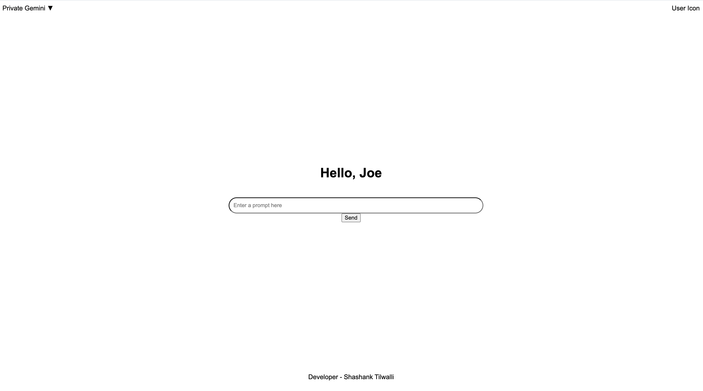

# Private Bard

Emulates Google's bard using Vertex API. 

## Getting Started

These instructions will get you a copy of the project up and running on your local machine for   
 development and testing purposes.

### Helpful Commands

Run this to test the HTML locally
uvicorn main:app --host 0.0.0.0 --port 80

curl -X POST \
  -H "Authorization: Bearer $(gcloud auth print-identity-token)" \
  -H "Content-Type: application/json" \
  -d '{"user_prompt": "Give me sample letter for resignation in 20 words"}' \
  "https://YOUR-URL/callPrivateGemini"

